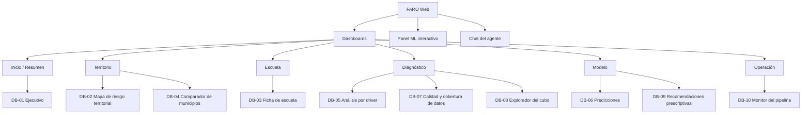

# Screen Specs — Portafolio de dashboards FARO

> Arquitectura de información de los 10 tableros (DB-01…DB-10), árbol de navegación de FARO Web y
> catálogo formal de KPIs con su fórmula SQL. Implementa **US-201** (REQ-002).
> → [[04_UX_Design/_index]] · Fuentes canónicas: [[03_Architecture/Data_Model]] · [[01_Product/PRD]]

---

## 1. Principios de diseño de los dashboards

| # | Principio | Origen |
|---|---|---|
| P1 | **Filtros globales** por ciclo escolar, entidad y nivel educativo que aplican al **conjunto** de tableros, no a uno solo | AC-002.2 |
| P2 | **`SIN_DATO` explícito, nunca cero ni nulo silencioso** — un cero afirmaría "no hay problema"; un nulo lo ocultaría | AC-001.6, AC-002.6 |
| P3 | **La escuela es la unidad mínima; jamás el alumno** (privacidad por diseño) | Data_Model §1 |
| P4 | Grano de análisis: **CCT × ciclo escolar**; agregaciones por municipio/entidad derivadas de Gold | Data_Model §4.1 |
| P5 | **Navegación cruzada** entre tableros: todo número debe poder llevarte al detalle que lo explica | US-205 |
| P6 | Cubos materializados para tiempos de respuesta aceptables; el KPI se define sobre el esquema canónico | Data_Model §4.3 |

---

## 2. Arquitectura de información de los 10 tableros

> Catálogo canónico ratificado en [[01_Product/PRD]] §12. Cada tablero traza a la historia que lo
> construye y al cubo de Gold que lo alimenta ([[03_Architecture/Data_Model]] §4.3).

| ID | Dashboard | Propósito | Audiencia | Cubo Gold | Historia |
|---|---|---|---|---|---|
| DB-01 | Ejecutivo | Visión global del sistema: matrícula, variación, riesgo y composición | Tomadores de decisión | `cubo_matricula` | US-203 |
| DB-02 | Mapa de riesgo territorial | Coroplético municipal + puntos de escuela por índice de riesgo | Gestores territoriales | `cubo_riesgo_territorial` | US-203 |
| DB-03 | Ficha de escuela | Drill-down por CCT: perfil, drivers, predicción y recomendación | Directores y gestores | `cubo_escuela_360` | US-212 |
| DB-04 | Comparador de municipios | Comparación lado a lado de municipios (matrícula, riesgo, rezago) | Analistas de política pública | `cubo_comparador_municipio` | US-212 |
| DB-05 | Análisis por driver | Distribución de los 6 drivers y su evolución | Analistas BI | `cubo_driver` | US-213 |
| DB-06 | Predicciones | Proyección de variación de matrícula (ML-01) y riesgo (ML-02) | Planificadores | `cubo_matricula` | US-204 |
| DB-07 | Calidad y cobertura | `indice_completitud_drivers` y territorios `SIN_DATO` | Equipo de datos / gobernanza | `cubo_completitud` | US-222 |
| DB-08 | Explorador del cubo | Pivotable y drill-down libre sobre el hecho | Analistas avanzados | `cubo_pivot` | US-213 |
| DB-09 | Recomendaciones prescriptivas | Qué intervención toca a cada escuela según su driver dominante | Tomadores + directores | `cubo_recomendaciones` | US-204 |
| DB-10 | Monitor del pipeline | Estado de la ingesta: filas por fuente, última carga, errores | Data Engineering / DevOps | `cubo_pipeline` | US-223 |

**KPIs globales** (AC-002.5): todo tablero muestra al menos los KPIs de contexto (matrícula, riesgo)
y una serie de tiempo de matrícula cuando el grano lo permite.

---

## 3. Árbol de navegación — FARO Web

Los 10 tableros se integran en **FARO Web** (Streamlit, `src/frontend/`), embebidos por guest token con
row-level security ([[03_Architecture/Frontend_Architecture]] · ADR-002). El andamiaje actual define las
secciones Dashboards / Panel ML / Chat.



### Navegación cruzada (drill-down)

| Desde | A | Vía |
|---|---|---|
| DB-01 Ejecutivo | DB-02 | municipio |
| DB-01 Ejecutivo | DB-03 | CCT (escuela) |
| DB-02 Mapa | DB-04 | municipio seleccionado |
| DB-02 Mapa | DB-03 | punto de escuela |
| DB-03 Ficha | DB-06 / DB-09 | predicción y recomendación de la escuela |
| DB-05 Driver | DB-07 | cobertura del driver seleccionado |
| DB-06 Predicciones | DB-09 | escuelas proyectadas en riesgo |
| DB-07 Cobertura | DB-05 | driver con vacíos |

---

## 4. Catálogo de KPIs con fórmula SQL

> Definición formal sobre el **esquema canónico** de Gold (`gold.fact_escuela_ciclo` + dimensiones). Cada
> KPI anota el cubo que lo materializa en runtime. Filtros comunes: `id_ciclo`, `cve_ent` y `nivel`.
>
> **Regla de lectura (Data_Model §4.1):** `fact_escuela_ciclo` solo contiene hechos observados. Las
> salidas de ML (`indice_riesgo` en `gold.predicciones`; `driver_dominante` y recomendaciones en
> `gold.recomendaciones`) se consultan **siempre por JOIN** de `cct, id_ciclo` — aplica a
> `cubo_riesgo_territorial`, `cubo_driver`, `cubo_recomendaciones` y `cubo_pivot`.

| ID | KPI | Grano | Nivel geo | Dashboards |
|---|---|---|---|---|
| KPI-01 | Matrícula total | entidad × municipio × ciclo | entidad / municipio | DB-01, DB-06 |
| KPI-02 | Variación de matrícula (%Δ ponderado) | entidad × ciclo | entidad | DB-01, DB-06 |
| KPI-03 | Índice de riesgo promedio | municipio × ciclo | municipio | DB-01, DB-02 |
| KPI-04 | Escuelas en riesgo | escuela × ciclo | municipio / entidad | DB-01, DB-02 |
| KPI-05 | Índice de completitud de drivers | escuela × ciclo | municipio / entidad | DB-07 |
| KPI-06 | % escuelas `SIN_DATO` por driver | driver × municipio × ciclo | municipio | DB-07 |
| KPI-07 | Driver dominante (distribución) | driver × ciclo | entidad | DB-01, DB-05, DB-09 |
| KPI-08 | Escuelas por nivel educativo | nivel × ciclo | entidad | DB-01 |
| KPI-09 | Escuelas por sostenimiento | sostenimiento × ciclo | entidad | DB-01 |
| KPI-10 | Riesgo por municipio (coroplético) | municipio × ciclo | municipio | DB-02 |
| KPI-11 | Recomendaciones por prioridad | cct × ciclo | entidad | DB-09 |
| KPI-12 | Variación proyectada (ML-01) | ciclo | entidad | DB-06 |
| KPI-13 | Estado de la ingesta (pipeline) | fuente × fecha_ingesta | nacional | DB-10 |
| KPI-14 | Contexto socioeconómico del municipio | municipio × ciclo | municipio | DB-04 |

### KPI-01 · Matrícula total

Suma de matrícula del ciclo seleccionado. **Cubo:** `gold.cubo_matricula`.

```sql
SELECT f.cve_mun,
       dt.ciclo,
       SUM(f.matricula_total) AS matricula_total
FROM gold.fact_escuela_ciclo f
JOIN gold.dim_tiempo dt ON f.id_ciclo = dt.id_ciclo
JOIN gold.dim_escuela e ON f.cct = e.cct
WHERE e.nivel = :nivel            -- filtro global (opcional)
GROUP BY f.cve_mun, dt.ciclo;
```

### KPI-02 · Variación de matrícula (%Δ ponderado)

Variación por escuela ponderada por su matrícula. **Cubo:** `gold.cubo_matricula`.

```sql
SELECT dt.ciclo,
       SUM(f.matricula_total) AS matricula_total,
       SUM(f.variacion_matricula * f.matricula_total)
         / NULLIF(SUM(f.matricula_total), 0) AS variacion_ponderada_pct
FROM gold.fact_escuela_ciclo f
JOIN gold.dim_tiempo dt ON f.id_ciclo = dt.id_ciclo
GROUP BY dt.ciclo;
```

### KPI-03 · Índice de riesgo promedio

Promedio de `indice_riesgo` (0–1) en el grano solicitado. El `indice_riesgo` es salida de ML-01
(`gold.predicciones`, `modelo = 'ML-01'`); se une por `cct, id_ciclo`. **Cubo:**
`gold.cubo_riesgo_territorial`.

```sql
SELECT f.cve_mun,
       AVG(p.indice_riesgo) AS indice_riesgo_promedio
FROM gold.fact_escuela_ciclo f
JOIN gold.predicciones p ON f.cct = p.cct AND f.id_ciclo = p.id_ciclo
WHERE p.modelo = 'ML-01'
GROUP BY f.cve_mun;
```

### KPI-04 · Escuelas en riesgo

Conteo de escuelas con `indice_riesgo >= 0.6` — **umbral ratificado por el negocio**: perder ~5% de
matrícula equivale a un riesgo de 0.60 (ver [[15_ML_Models/Indice_Riesgo_ML01]]).

```sql
SELECT COUNT(*) FILTER (WHERE p.indice_riesgo >= 0.6) AS escuelas_en_riesgo,
       COUNT(*)                                       AS total_escuelas
FROM gold.fact_escuela_ciclo f
JOIN gold.predicciones p ON f.cct = p.cct AND f.id_ciclo = p.id_ciclo
WHERE p.modelo = 'ML-01';
```

### KPI-05 · Índice de completitud de drivers

Qué fracción de los 6 drivers está observada en cada escuela (0–1). **Cubo:** `gold.cubo_completitud`.

```sql
SELECT AVG(f.indice_completitud_drivers) AS completitud_promedio
FROM gold.fact_escuela_ciclo f;
```

### KPI-06 · % escuelas `SIN_DATO` por driver

Porcentaje de escuelas sin dato para cada driver. **Nunca se muestra como cero**: el `SIN_DATO` es el
hallazgo (dónde el Estado no está mirando). **Cubo:** `gold.cubo_completitud`.

```sql
SELECT driver,
       COUNT(*) FILTER (WHERE cobertura = 'SIN_DATO') * 100.0
         / NULLIF(COUNT(*), 0) AS pct_sin_dato
FROM (
    SELECT 'D1' AS driver, f.d1_cobertura AS cobertura FROM gold.fact_escuela_ciclo f
    UNION ALL SELECT 'D2', f.d2_cobertura FROM gold.fact_escuela_ciclo f
    UNION ALL SELECT 'D3', f.d3_cobertura FROM gold.fact_escuela_ciclo f
    UNION ALL SELECT 'D4', f.d4_cobertura FROM gold.fact_escuela_ciclo f
    UNION ALL SELECT 'D5', f.d5_cobertura FROM gold.fact_escuela_ciclo f
    UNION ALL SELECT 'D6', f.d6_cobertura FROM gold.fact_escuela_ciclo f
) drivers
GROUP BY driver;
```

### KPI-07 · Driver dominante (distribución)

Escuelas por driver que explica su riesgo (salida de ML-02). El `driver_dominante` vive en
`gold.recomendaciones` (Data_Model §4.1); se une por `cct, id_ciclo`.

```sql
SELECT dd.id_driver,
       dd.nombre,
       COUNT(*) AS escuelas
FROM gold.fact_escuela_ciclo f
JOIN gold.recomendaciones r ON f.cct = r.cct AND f.id_ciclo = r.id_ciclo
JOIN gold.dim_driver dd ON r.driver_dominante = dd.id_driver
GROUP BY dd.id_driver, dd.nombre
ORDER BY escuelas DESC;
```

### KPI-08 · Escuelas por nivel educativo

```sql
SELECT e.nivel,
       COUNT(DISTINCT f.cct) AS escuelas
FROM gold.fact_escuela_ciclo f
JOIN gold.dim_escuela e ON f.cct = e.cct
GROUP BY e.nivel;
```

### KPI-09 · Escuelas por sostenimiento

```sql
SELECT e.sostenimiento,
       COUNT(DISTINCT f.cct) AS escuelas
FROM gold.fact_escuela_ciclo f
JOIN gold.dim_escuela e ON f.cct = e.cct
GROUP BY e.sostenimiento;
```

### KPI-10 · Riesgo por municipio (coroplético)

Base del mapa de DB-02. Llave de cruce: `cve_mun` de 5 dígitos (entidad 2 + municipio 3). Umbral de
riesgo ratificado: 0.6 = perder ~5% de matrícula (ver [[15_ML_Models/Indice_Riesgo_ML01]]).
**Cubo:** `gold.cubo_riesgo_territorial`.

```sql
SELECT f.cve_mun,
       dm.nombre_municipio,
       dm.nombre_entidad,
       AVG(p.indice_riesgo) AS riesgo_promedio,
       COUNT(*) FILTER (WHERE p.indice_riesgo >= 0.6) AS escuelas_en_riesgo
FROM gold.fact_escuela_ciclo f
JOIN gold.dim_municipio dm ON f.cve_mun = dm.cve_mun
JOIN gold.predicciones p ON f.cct = p.cct AND f.id_ciclo = p.id_ciclo
WHERE p.modelo = 'ML-01'
GROUP BY f.cve_mun, dm.nombre_municipio, dm.nombre_entidad;
```

### KPI-11 · Recomendaciones por prioridad

Distribución de las recomendaciones prescriptivas (DB-09, diferenciador del proyecto). **Cubo:**
`gold.cubo_recomendaciones`.

```sql
SELECT r.prioridad,
       COUNT(*) AS recomendaciones
FROM gold.recomendaciones r
GROUP BY r.prioridad;
```

### KPI-12 · Variación proyectada (ML-01)

Variación de matrícula proyectada por el modelo de regresión. **Cubo:** `gold.cubo_matricula`.

```sql
SELECT dt.ciclo,
       AVG(p.valor) AS variacion_proyectada_promedio
FROM gold.predicciones p
JOIN gold.dim_tiempo dt ON p.id_ciclo = dt.id_ciclo
WHERE p.modelo = 'ML-01'
GROUP BY dt.ciclo;
```

### KPI-13 · Estado de la ingesta (pipeline)

Filas por fuente y momento de la última carga (DB-10). Grano nacional.

```sql
SELECT fuente,
       COUNT(*)          AS filas,
       MAX(_ingested_at) AS ultima_ingesta
FROM gold.cubo_pipeline
GROUP BY fuente;
```

### KPI-14 · Contexto socioeconómico del municipio

Variables de contexto para el comparador de municipios (DB-04). **Cubo:**
`gold.cubo_comparador_municipio`.

```sql
SELECT f.cve_mun,
       dm.nombre_municipio,
       dm.pobreza_pct,
       dm.grado_rezago,
       dm.indice_rezago_social
FROM gold.fact_escuela_ciclo f
JOIN gold.dim_municipio dm ON f.cve_mun = dm.cve_mun
GROUP BY f.cve_mun, dm.nombre_municipio, dm.pobreza_pct,
         dm.grado_rezago, dm.indice_rezago_social;
```

---

## 5. Filtros globales

| Filtro | Fuente | Aplica a | Notas |
|---|---|---|---|
| **Ciclo escolar** | `dim_tiempo.id_ciclo` | todos los tableros | último ciclo como default |
| **Entidad** | `dim_municipio.cve_ent` | todos los tableros | acotado a `SCOPE_ENTIDADES` (09, 15, 19, 14) |
| **Nivel educativo** | `dim_escuela.nivel` | todos los tableros | primaria, secundaria, media superior… |

Los tres filtros son persistentes entre tableros (AC-002.2): al cambiarlos en FARO Web, el valor se
propaga a todos los dashboards embebidos vía los parámetros del guest token.

---

## 6. Trazabilidad

- **Implementa:** US-201 (portafolio + catálogo de KPIs)
- **Consume:** [[03_Architecture/Data_Model]] (esquema Gold y cubos) · [[01_Product/PRD]] (§12 catálogo DB)
- **Alimenta:** US-202 (capa semántica), US-203…US-205, US-211a/b…US-223 (construcción de tableros)
- **Sustenta AC:** AC-002.1, AC-002.2, AC-002.5, AC-002.6
