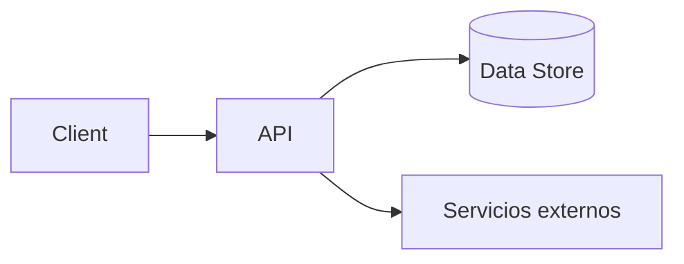

# System Design — FARO

> → [[vault/03_Architecture/_index]]

## Diagrama de alto nivel

## Componentes
| Componente | Responsabilidad | Dueño |
|---|---|---|

## Decisiones clave
Ver [[vault/03_Architecture/ADRs/_index]].

## Requisitos no funcionales que impactan el diseño
<!-- Rendimiento, escalabilidad, seguridad → enlaza a 07_Security y 11_Operations -->
