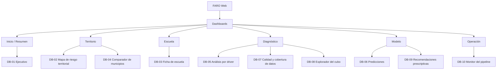

# Manual de Usuario — Dashboards FARO

> Guía en lenguaje de negocio de los 10 tableros de FARO, pensada para el equipo (onboarding
> rápido), el pitch de entrega y quien evalúe el proyecto. No repite el detalle técnico ya fijado
> en [[vault/04_UX_Design/Screen_Specs]] (SQL, grano, cubo Gold) — este documento explica **qué
> ve el usuario y qué decisión apoya cada tablero**.

## ⚠️ Estado de este manual (léelo antes de usarlo)

Este documento se escribió sin capturas de pantalla reales. La razón: el Postgres local no tiene
Bronze cargado (mismo bloqueo estructural que documentan [[vault/04_UX_Design/Cube_Specs_DB07]] y
[[vault/04_UX_Design/Cube_Specs_DB10]]), así que ningún dashboard puede renderizarse con datos de
producción en este ambiente. Se evaluó usar los mocks sintéticos ya sancionados por el equipo
(`superset/mock/*.sql`, mismo patrón de US-203/US-212) para al menos DB-01/DB-02, pero se decidió
no forzarlo por tiempo — más vale un manual completo y honesto hoy que dos dashboards con datos de
prueba y ocho placeholders.

**Cada sección de dashboard tiene un marcador `[CAPTURA PENDIENTE]`.** Quien tenga el ambiente con
Bronze cargado (local con `dbt run` completo, o el ambiente validado que usó Luis Téllez el
2026-09-01) puede tomar las capturas y reemplazar los marcadores sin tocar el resto del texto.

| Dashboard | Estado de datos conocido |
|---|---|
| DB-01, DB-02 | Validados con datos reales por Luis Téllez (2026-09-01): 9/9 y 7/7 charts con datos, filtros funcionando. Capturas pendientes de tomarse sobre ese ambiente. |
| DB-03…DB-06, DB-08, DB-09 | Construidos (PR mergeados), sin confirmación reciente de validación en vivo — verificar antes de usar en demo. |
| DB-07, DB-10 | SQL y 12 pruebas automatizadas en verde contra fixtures; **registro en Superset bloqueado** por falta de Bronze (documentado en sus Cube Specs). No van a aparecer poblados en una demo local hasta resolver ese bloqueo. |

---

## 1. Cómo entrar

Los 10 tableros viven en Superset y se embeben en **FARO Web** (Streamlit) por guest token con
row-level security — no se navega a Superset directamente en producción
([[vault/03_Architecture/Frontend_Architecture]], ADR-002).

**En local (para desarrollo/pruebas):**
```bash
docker compose up -d db superset
# Superset queda en http://localhost:8088
```
Usuario y contraseña de administrador están en tu `.env` (`SUPERSET_ADMIN_USERNAME` /
`SUPERSET_ADMIN_PASSWORD`) — nunca los compartas ni los pegues en un prompt de IA.

**En producción:** la URL pública activa es la de la API
([https://faro-api-eanzfglvyq-uc.a.run.app](https://faro-api-eanzfglvyq-uc.a.run.app), ver
`README.md`). El despliegue de FARO Web con los dashboards embebidos es responsabilidad de
Célula 5 — confirma con Luis Téllez la URL vigente antes de una demo en vivo.

---

## 2. Los tres filtros que cambian todo

Cada tablero respeta los mismos tres filtros globales (AC-002.2), sincronizados entre sí — cambias
uno y se propaga a todos los tableros que abras después:

| Filtro | Qué hace | Nota |
|---|---|---|
| **Ciclo escolar** | Acota todo a un año escolar | Por default, el más reciente |
| **Entidad federativa** | CDMX, Edomex, Nuevo León o Jalisco | El proyecto es nacional por diseño; se acota a estas 4 por cobertura de datos, no por capacidad |
| **Nivel educativo** | Primaria, secundaria, media superior… | Vacío = todos los niveles |

**Regla que vas a ver repetida en cada tablero:** cuando un dato no existe, el tablero muestra
literalmente **`SIN_DATO`** — nunca un cero. Un municipio sin cobertura de un driver no desaparece
del mapa ni cae a 0: se dibuja como hueco. Esa distinción es el corazón del diferenciador del
proyecto (DB-07 la convierte en un hallazgo propio).

---

## 3. Mapa de navegación



Los tableros están conectados por clic (drill-down), no solo por menú:

| Desde | Llegas a | Dando clic en |
|---|---|---|
| DB-01 Ejecutivo | DB-02 | un municipio |
| DB-01 Ejecutivo | DB-03 | una escuela (CCT) |
| DB-02 Mapa | DB-04 | el municipio seleccionado |
| DB-02 Mapa | DB-03 | un punto de escuela |
| DB-03 Ficha | DB-06 / DB-09 | la predicción o recomendación de esa escuela |
| DB-05 Driver | DB-07 | el driver con vacíos que te interesa |
| DB-06 Predicciones | DB-09 | las escuelas proyectadas en riesgo |
| DB-07 Cobertura | DB-05 | el driver con más `SIN_DATO` |

---

## 4. Los 10 dashboards

### DB-01 · Ejecutivo

**Para quién:** tomadores de decisión que quieren la foto completa en 10 segundos.
**Qué ves:** matrícula total del ciclo, su variación contra el ciclo anterior, cuántas escuelas
están en riesgo y cómo se compone el sistema (por nivel, por sostenimiento). Incluye una serie de
tiempo de matrícula y la distribución del driver dominante.
**Cómo leerlo:** empieza por la tarjeta de matrícula total y su variación — si baja, el resto del
tablero te dice por qué (el pie de drivers) y a quién le pasa (da clic en un municipio → DB-02).

[CAPTURA PENDIENTE: DB-01 — panel completo con las 9 visualizaciones]

### DB-02 · Mapa de riesgo territorial

**Para quién:** gestores territoriales que necesitan ver **dónde** está el riesgo, no solo cuánto.
**Qué ves:** un mapa coroplético por municipio (color = índice de riesgo promedio) más los puntos de
cada escuela, con un umbral de riesgo fijado en 0.6 (equivale a ~5% de pérdida de matrícula
proyectada).
**Cómo leerlo:** el color del municipio es la primera señal; da clic para ver sus escuelas
individuales y de ahí a la ficha de cualquiera (DB-03). Ningún municipio sin predicción se pinta de
gris "cero" — si no hay dato, el mapa lo deja explícitamente vacío.

[CAPTURA PENDIENTE: DB-02 — coroplético + puntos de escuela + leyenda]

### DB-03 · Ficha de escuela

**Para quién:** directores y gestores que quieren el perfil de UNA escuela específica.
**Qué ves:** al buscar un CCT, obtienes su serie de matrícula, sus 6 drivers (con hueco donde falte
dato, nunca cero), su predicción de riesgo y — el diferenciador del proyecto — una recomendación
prescriptiva ligada al driver que más le pesa a esa escuela.
**Cómo leerlo:** si la escuela aún no tiene predicción (el modelo ML-01 llega en Sprint 4), el
bloque de predicción dice "sin dato disponible" en vez de desaparecer o mostrar 0 — la ficha se
sigue viendo completa.

[CAPTURA PENDIENTE: DB-03 — ficha completa de una escuela de ejemplo]

### DB-04 · Comparador de municipios

**Para quién:** analistas de política pública comparando dos o más municipios lado a lado.
**Qué ves:** matrícula, riesgo y contexto socioeconómico (pobreza, rezago social) de los municipios
que elijas, en paralelo.
**Cómo leerlo:** útil para justificar dónde priorizar intervención cuando dos municipios se ven
parecidos en matrícula pero muy distintos en rezago social.

[CAPTURA PENDIENTE: DB-04 — comparación de 2-3 municipios]

### DB-05 · Análisis por driver

**Para quién:** analistas BI explorando cuál de los 6 drivers pesa más y dónde.
**Qué ves:** un tab por driver (D1 pobreza, D2 inseguridad, D3 infraestructura, D4 conectividad, D5
estrés hídrico, D6 calidad del aire) con su distribución territorial.
**Cómo leerlo:** si un driver tiene mucho `SIN_DATO` en cierta zona, es la pista para saltar a DB-07
y ver el mapa de vacíos completo.

[CAPTURA PENDIENTE: DB-05 — un tab de driver como ejemplo]

### DB-06 · Predicciones

**Para quién:** planificadores que quieren ver hacia dónde va la matrícula, no solo dónde está hoy.
**Qué ves:** la variación de matrícula proyectada por el modelo ML-01 para el siguiente ciclo.
**Cómo leerlo:** compara la proyección contra la variación histórica (DB-01) — la diferencia es la
señal de alerta temprana que justifica intervenir antes de que la matrícula ya haya caído.

[CAPTURA PENDIENTE: DB-06 — proyección de variación]

### DB-07 · Calidad y cobertura de datos

**Para quién:** equipo de datos y gobernanza — este tablero es sobre la confiabilidad del resto.
**Qué ves:** qué tan completos están los 6 drivers por municipio y nivel, y un mapa de los vacíos
territoriales (dónde el Estado literalmente no está midiendo).
**Cómo leerlo:** es el tablero que convierte una limitación de datos en un hallazgo de valor —
"aquí no sabemos" es en sí mismo información útil para dónde invertir en instrumentación.
**Nota de estado:** SQL y 7 pruebas automatizadas en verde; el registro real en Superset está
bloqueado en este ambiente por falta de Bronze (ver [[vault/04_UX_Design/Cube_Specs_DB07]] §4).

[CAPTURA PENDIENTE: DB-07 — mapa de vacíos + completitud por driver]

### DB-08 · Explorador del cubo

**Para quién:** analistas avanzados que quieren pivotar y filtrar libremente, sin un tablero
prearmado para su pregunta específica.
**Qué ves:** una tabla pivotable sobre el cubo de drivers, con drill-down libre por nivel,
sostenimiento y territorio.
**Cómo leerlo:** úsalo cuando ninguno de los otros 9 tableros responda exactamente tu pregunta.

[CAPTURA PENDIENTE: DB-08 — vista pivote de ejemplo]

### DB-09 · Recomendaciones prescriptivas

**Para quién:** tomadores de decisión y directores — el tablero que responde "¿y ahora qué hago?".
**Qué ves:** qué intervención le toca a cada escuela según su driver dominante, priorizadas.
**Cómo leerlo:** este es el tablero que demuestra el diferenciador del proyecto frente a un dashboard
puramente descriptivo — dos escuelas con el mismo nivel de riesgo pueden aparecer aquí con
recomendaciones distintas si su driver dominante es distinto.

[CAPTURA PENDIENTE: DB-09 — recomendaciones por prioridad]

### DB-10 · Monitor del pipeline

**Para quién:** Data Engineering / DevOps — salud operativa, no analítica de negocio.
**Qué ves:** las 8 fuentes de datos del catálogo, cuántas filas trajo cada una y cuándo fue su
última carga exitosa. Una fuente sin ingesta todavía se queda en la lista marcada `SIN_DATO`, nunca
desaparece ni se cuenta como cero filas.
**Cómo leerlo:** si vas a hacer una demo en vivo, revisa este tablero primero — te dice qué fuentes
están realmente cargadas antes de prometer un número en los otros 9.
**Nota de estado:** mismo bloqueo que DB-07 — 5 pruebas en verde contra fixtures, sin validar contra
Postgres real en este ambiente (ver [[vault/04_UX_Design/Cube_Specs_DB10]] §4).

[CAPTURA PENDIENTE: DB-10 — estado de las 8 fuentes]

---

## 5. Guía rápida para el pitch

Orden sugerido para una demo de ~10 minutos, pensado para que el hilo narrativo sea "de lo general
a la escuela, y de la escuela a la acción":

1. **DB-01 Ejecutivo** — arranca con la foto completa: cuántas escuelas, cuánta matrícula, cuántas
   en riesgo. Es el "así está el sistema hoy".
2. **DB-02 Mapa de riesgo** — clic en un municipio con riesgo visible. "Esto no es un número
   abstracto, está en un lugar".
3. **DB-03 Ficha de escuela** — clic en una escuela dentro de ese municipio. Muestra el perfil
   completo y **cierra con la recomendación prescriptiva** — este es el momento del pitch que
   distingue el proyecto de un dashboard descriptivo cualquiera.
4. **DB-09 Recomendaciones** — amplía el zoom: la misma lógica de la ficha, pero a escala de todas
   las escuelas priorizadas.
5. **DB-07 Calidad y cobertura** — cierra reconociendo los límites con transparencia: "esto es lo
   que no sabemos todavía, y por qué el `SIN_DATO` es en sí mismo un hallazgo, no un error".

**Si algo no carga en vivo:** ten `DB-10 Monitor del pipeline` abierto en otra pestaña para explicar
en tiempo real qué fuente está fallando, en vez de que parezca un bug silencioso.

---

## 6. Trazabilidad

- **Implementa:** US-224 (REQ-002)
- **Consume:** [[vault/04_UX_Design/Screen_Specs]] (catálogo de KPIs y arquitectura de los 10
  dashboards, US-201) · [[vault/04_UX_Design/Cube_Specs_DB07]] · [[vault/04_UX_Design/Cube_Specs_DB10]]
  (bloqueo de datos documentado)
- **Pendiente:** reemplazar los 10 marcadores `[CAPTURA PENDIENTE]` cuando el ambiente tenga Bronze
  cargado; actualizar la tabla de la sección "Estado de este manual" en cada revisión
